### Projeto de Data Warehousing & Business Intelligence (2018.2)
> (Python + SQL + Pentaho) <br>
> Sistemas de Informação - UFRPE <br>

### Índice
* [1) Objetivos
* [2) Instalação e configuração
* [3) Consultas e resultados
* [4) Equipe

### Objetivos

- [X] Aplicar os conceitos e ferramentas utilizados durante a disciplina na base de dados abertos do INEP do censo escolar brasileiro;
- [X] Criar consultas, apresentadas através de gráficos e um mapa de calor;

### Instalação e configuração

* 1.1) Primeiramente é necessário ter instalado no seu sistema os seguintes itens:
- [X] [MySQL](https://dev.mysql.com/downloads/installer/)
- [X] [Pentaho DI](https://community.hitachivantara.com/docs/DOC-1009931-downloads)
- [X] [Pentaho BA](https://community.hitachivantara.com/docs/DOC-1009931-downloads)
- [x] [Anaconda](https://www.anaconda.com/download/)
* 1.1.1) Após a instalação, verificar se o Anaconda foi corretamente instalado através do terminal, ou cmd, usando o comando:

```
$ conda --version
```
* 1.1.1) É necessário adicionar um arquivo de conexão do MySQL com o Pentaho DI. Após realizar o download completo do Pentaho DI, baixe o arquivo no link abaixo e o coloque ele na pasta "lib", dentro do diretório onde foi salvo o Pentaho DI.

- [x] [JDBC MySQL connector](https://drive.google.com/open?id=1fVquCcVzEZcWpbqfdtVvoSDC8Y35ZM1f)

* 1.2) Através do terminal/cmd instale os pacotes necessários: Pandas e Folium, pelos comandos abaixo:

```
$ conda install -c anaconda pandas
```

```
$ conda install -c conda-forge folium
```
* 1.2.1) Alguns dados usados no processo de geração dos mapas de calor são muito grandes, por isso deixamos eles disponíveis no drive abaixo. Basta baixá-los e colocar todos, sem alterar nenhuma informação, na past "plot" do repositório.

- [x] [arquivos](https://drive.google.com/open?id=1fUoPaMbR2p52E1ipEZza8P_d7xvThuzB)

* 1.2.1) Ao final do processo a pasta "plot" deve conter os arquivos como na imagem:

  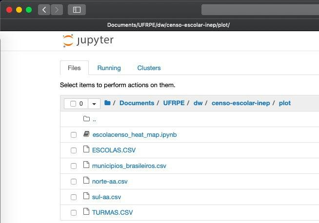

* 1.3) Agora com os pacotes instalados e os arquivos baixados é necessário iniciar o Jupyter. No terminal - ou cmd - digite o comando:

```
$ jupyter-notebook
```

* 1.4) Após o serviço do Jupyter ser iniciado navegue através do mesmo até a pasta "plot" dentro do local onde o repositório repositório foi baixado.

  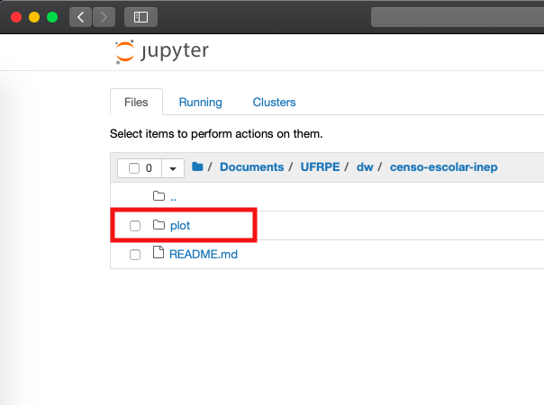

* 1.4.1) Dentro desta pasta consta o notebook "escolacenso_heat_map.ipynb", somente clicando nele através do Jupyter ele será iniciado.

  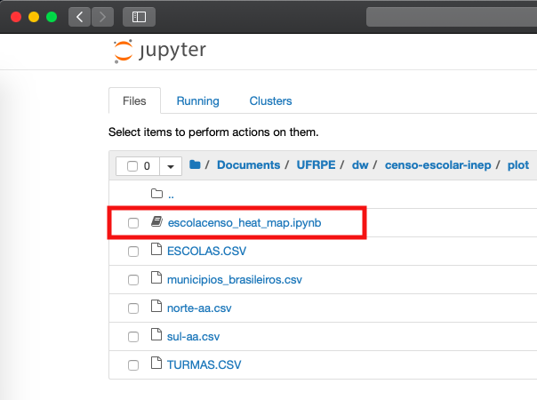
  
* 1.4.2) Dentro do notebook existem blocos que chamamos de células. É necesśario executar cada célula na ordem já definida dentro do notebook para evitar erros. Cada célula possui comentários que explicam o que cada bloco está fazendo para construir os mapas de calor.
 
  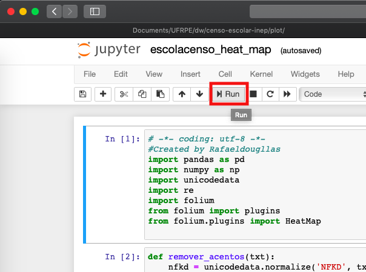

### Consultas e resultados

É necessário executar alguns scripts antes de aplicarmos as transformações no Pentaho DI.

* Inicie o seu SGBD MySQL. Recomendamos aqui o uso do XAMPP e do MySQL Workbench.

* Dentro do repositório, na pasta "SQL-scripts_modelo", execute primeiro o script "escolacenso_base.sql". Ele irá gerar o banco de dados relacional da base utilizada no projeto.

* Em seguida, execute o script "script_popular_base.sql" para inserir os dados na base de origem.

* Com os dados inseridos deve-se executar agora o script "escolacenso_dw.sql". Ele irá gerar o modelo dimensional utilizado neste projeto.

* Agora, dentro da pasta do Pentaho DI, procure pelos arquivos "spoon.bat", para Windows, e "spoon.sh", para Mac e Linux. No Windows é recomendado executar o arquivo como administrador, evitando possíveis erros. No Mac ou Linux, através do terminal, navegue até a pasta do Pentaho DI e execute o seguinte comando:

```
$ ./spoon.sh
```

* Com o Pentaho BI em execução, dentro do Pentaho, navegue até a pasta "ETL-transformacoes". Ela contém os seguintes arquivos:

```
  1. Dim_Acessibilidade.ktr
  2. Dim_Agua.ktr
  3. Dim_Dependencia.ktr
  4. Dim_Energia.ktr
  5. Dim_Escola.ktr
  6. Dim_Esgoto.ktr
  7. Dim_Internet.ktr
  8. Dim_Localizacao.ktr
  9. Dim_Necessidade_Especial.ktr
  10. Dim_Raca.ktr
  11. Dim_Sexo.ktr
  12. Fato_Aluno_NE.ktr
  13. FatoInfraestrutura.ktr
```

* Ao abrir qualquer um dos arquivos, verifique as conexões, na aba "View".

  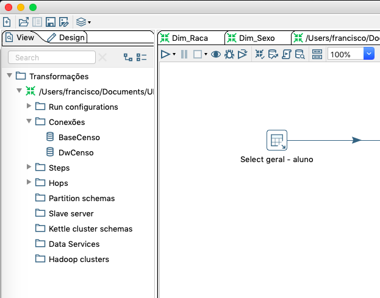
  
 * A configuração padrão da conexão com o MySQL deve ficar como na imagem, de acordo com os padrões do seu ambiente. Após isso, aperte no botão "Test" para verificar a conexão.
 
  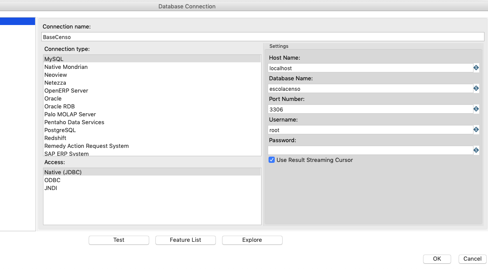

* Vale ressaltar que as transformações podem ser executadas independente da ordem, no entanto as transformações "Fato_Aluno_NE.ktr" e "FatoInfraestrutura.ktr", devem ser executadas por último. Feito isso, o data warehousing estará carregado.

* Depois das transformações prontas utilize o Pentaho BI(Business Inteligente) juntamente com o Saiku(instalar o Saiku dentro do diretório abaixo) para visualizar os cubos e realizar qualquer operação de consulta desejada.

```
pentaho-server/pentaho-solutions/system/
```

Através da análise dos cubos no Pentaho BI podemos responder a várias perguntas de maneira gráfica.

* Qual a quantidade de alunos por tipo de deficiência, divididos entre as zonas rural e urbana nas escolas estaduais, municipais, federais e privadas?

  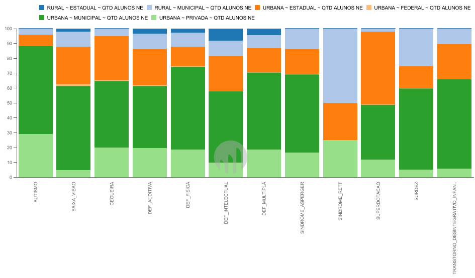
  
* Nas zonas rural e urbana das regiões norte e sul do país, qual a quantidade de alunos, de acordo com sexo e raça declarada?

  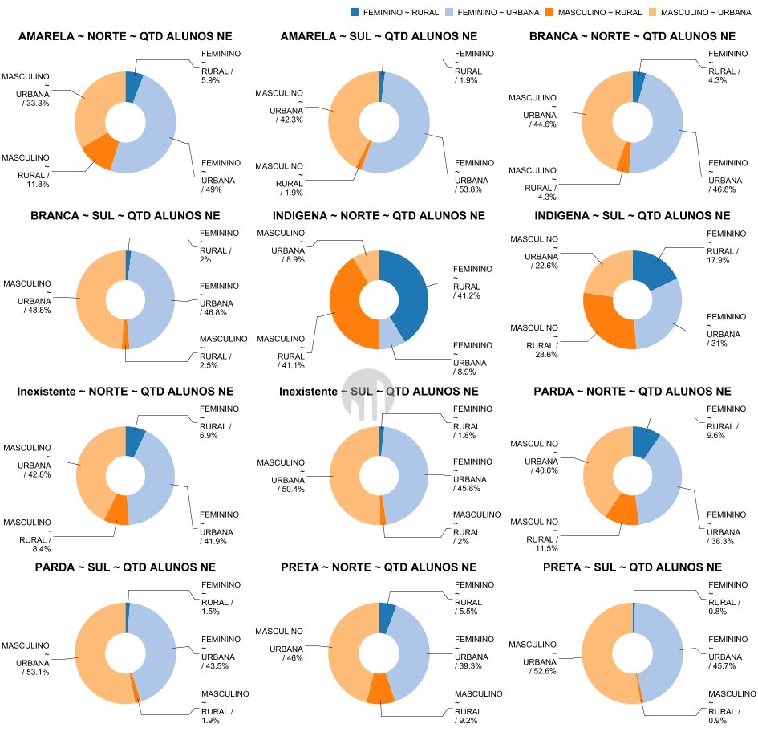
  
* Como podemos classificar, de acordo com o abastecimento de água as escolas nos estados das regiões norte e sul?

  
  
* Como é então a questão do abastecimento de esgoto nestas escolas?

  
  
* Qual a quantidade de escolas nos estados das regiões norte e sul que possuem banheiro adptado, sala de atendimento especial e outras depedências referentes à acessibilidade?

  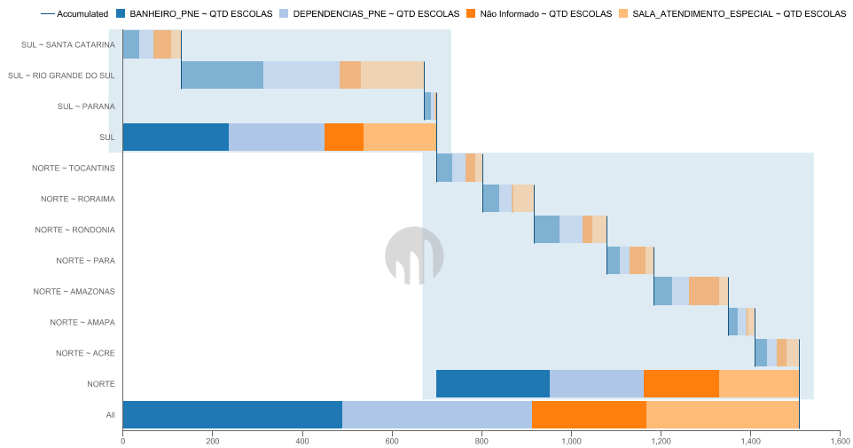

* Como fica a distribuição das escolas sem acesso a internert?

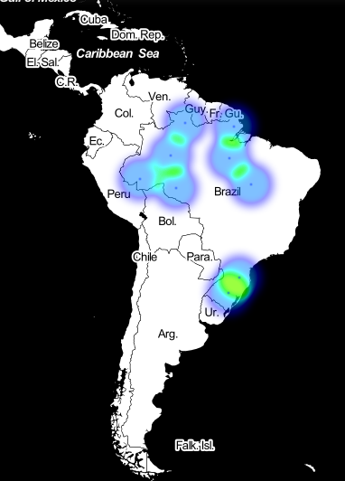

* A distribuição fica muito parecida no caso das escolas que tem internet?

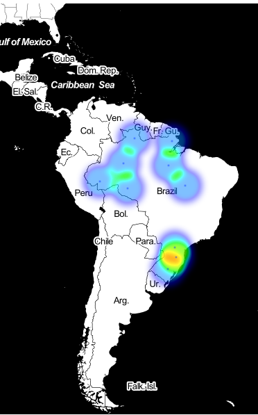

* Como fica a distribuição dos alunos que são pessoas com deficiência e estudam em escolas rurais?

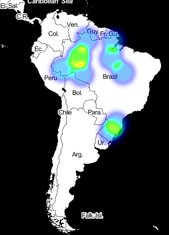

Como usamos os mapas de calor anteriormente podemos identificar também a distribuição dos alunos e escolas. Durante o processo da análise de dados encontramos algumas inconsistências: alunos matriculados em escolas do norte do país com endereço em regiões diferentes.

  
  
Podemos entender esse problema da seguinte maneira: alunos que se mudam não tem seus dados atualizados na base, já que o censo é realizado de maneira anual,podendo ocorrer problemas como este. Após uma limpeza nos dados nós temos o seguinte mapa para a distribuição dos alunos, por localização:

  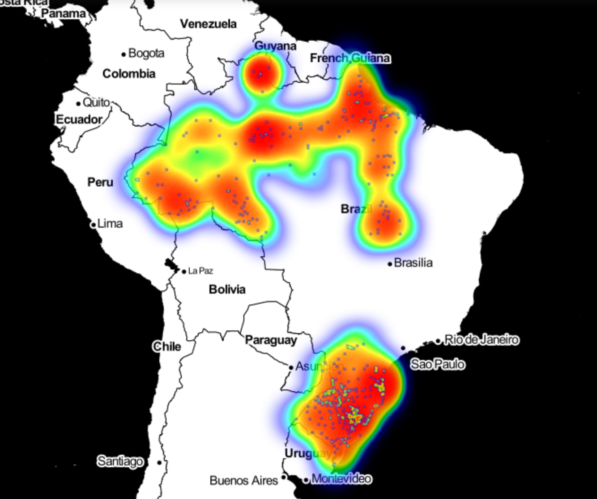
  
E também a distribuição das escolas nestas regiões:

  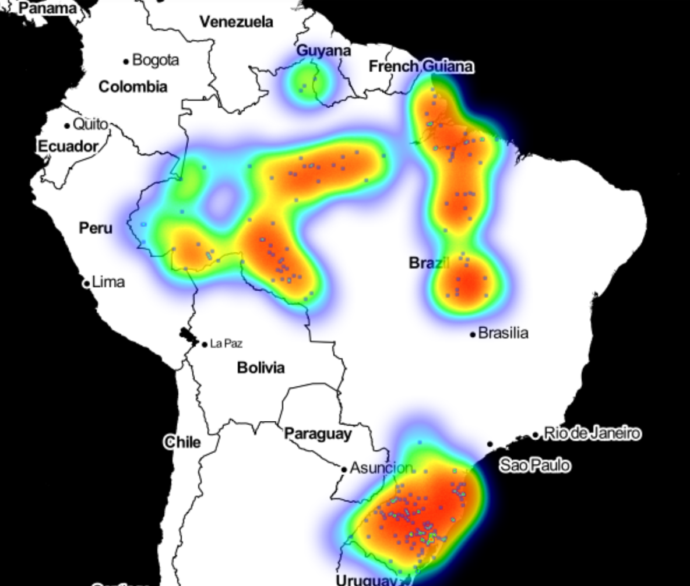

### Equipe
- [Francisco Queiroga](https://github.com/chicoqueiroga)<br>
- [Rafael Douglas](https://github.com/rafaeldougllas)<br>
- [Everton Veloso](https://github.com/everton-nv)<br>
- [Jadiel Eudes](https://github.com/Eudess)<br>
- [Evele Lemos](https://github.com/lemosevele)<br>
